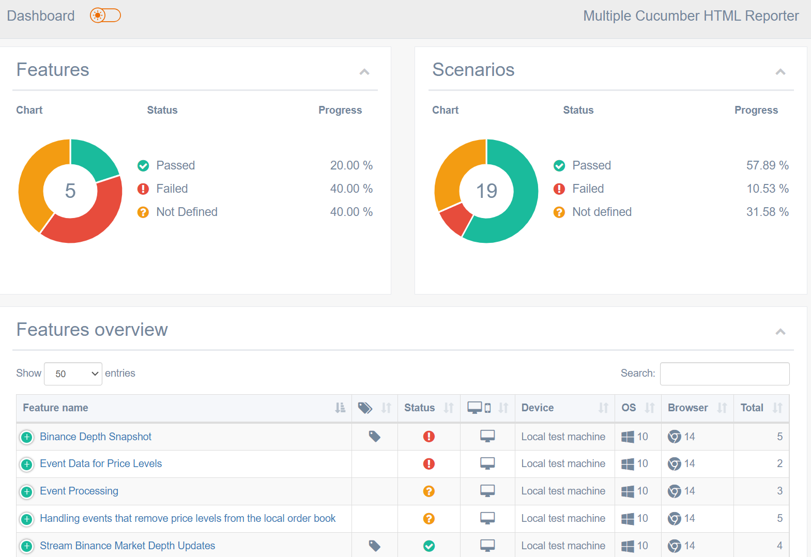
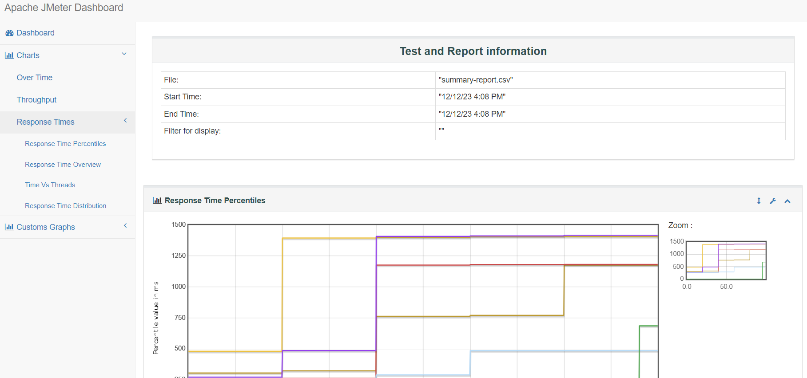

# Testing local order book with Cypress + Cucumber + Jmeter

## Introduction
This project is a Cypress test suite written in TypeScript, utilizing the Cucumber preprocessor for BDD-style tests to cover how to correctly manage a local order book in financial and trading applications (more details [here](https://binance-docs.github.io/apidocs/spot/en/#diff-depth-stream)).  
It includes the Cypress-recurse plugin for recursive folder execution, ESLint for linting, and generates test reports using the Cucumber preprocessor.
Its include also performance testing in order to test API Binance request with multiple execution samples.

## Prerequisite

Make sure you have Node.js and npm installed on your machine.


## Tools/Dependencies

**@badeball/cypress-cucumber-preprocessor** is a plugin for Cypress that enables the use of Cucumber with Gherkin syntax for writing tests. This allows to write tests in a more human-readable format and follow Behavior-Driven Development (BDD) principles.  
For more details, check the official documentation : [Here](https://github.com/badeball/cypress-cucumber-preprocessor)

**@bahmutov/cypress-esbuild-preprocessor** is a Cypress preprocessor that uses ESBuild to quickly bundle and transpile modern JavaScript code, allowing to speed up Cypress tests.  
For more details, check the official documentation : [Here](https://github.com/bahmutov/cypress-esbuild-preprocessor)

**cypress-recurse** is a Cypress plugin that allows to recursively run Cypress tests from multiple directories, providing a convenient way to organize and execute tests in a modular manner.  
For more details, check the official documentation : [Here](https://github.com/bahmutov/cypress-recurse)

**multiple-cucumber-html-reporter** is a comprehensive reporting tool for Cucumber test results. It allows to generate detailed and visually appealing HTML reports for Cucumber test runs, making it easier to analyze and share the results with your team.
For more details, check the official documentation : [Here](https://github.com/WasiqB/multiple-cucumber-html-reporter)

**JMeter** is an open-source Java application designed to load test and measure performance. It can be used to simulate a heavy load on a server, network, or object to test its strength or to analyze overall performance under different load types.
For more details, check the official documentation : [Here](https://jmeter.apache.org/usermanual/get-started.html#install)


## Setup

1. Clone the repository:

   ```bash
   git clone <repository-url>
   ```

2. Install dependencies:

    ```bash
    cd your-project-directory
    npm install
    ```

For Jmeter, **only the Windows packaging version** is installed on this repository.  
For **MacOS/Linux users**, you can follow this documention for the setup : [here](https://jmeter.apache.org/download_jmeter.cgi)

## Running Tests
### Run Cypress Tests in Interactive mode

    npm run cy:open

### Run Cypress Headless Tests

    npm run cy:run

### Run Tests with Cucumber Tags

    npm run cy:tags -- --tags "@smoke"

### Run Jmeter Headless Tags

    npm run jmeter:test

#### Breakdown of the Command:
This **npm run cypress:tags** : This runs a script named cypress:tags using npm. The actual script content is not provided here, but it presumably triggers Cypress tests.

This **--** : This is used to separate npm run script arguments from the arguments you want to pass to the script itself.

This **--tags "@smoke"**: These are arguments passed to the Cypress script. In Cypress, tags are often used to categorize tests. In this case, the tag being used is @smoke. This means that only tests tagged with @smoke will be executed.
 

#### Explanation:
The command is designed to execute a subset of Cypress tests, specifically those tagged with @smoke. This can be useful for running a focused set of tests, such as smoke tests that check the basic scenarios of tests.


### Generate Cucumber Test Report

#### For Cypress + Cucumber

After installing `multiple-cucumber-html-reporter` using npm:

    npm install multiple-cucumber-html-reporter --save-dev  

Use a configuration file, for example, `utils/cucumber-html-report.js` to format the test report in JSON to a beautiful HTML report.

Run the script to generate the HTML report:  

    npm run cy:test:report 

The HTML report will be generated and available in the specified output folder. Open the index.html file in a web browser to view the consolidated test report.

**Important**:  
For MacOS user:  
To generate test report , in `package.json`, replace the current configuration : 

    "cypress-cucumber-preprocessor": {
        "json": {
        "enabled": true,
        "output": "reports/cypress/json/test-reports.json",
        "formatter": "utils/cucumber-json-formatter/windows/cucumber-json-formatter.exe" 
        },
    }

by this: 

    "cypress-cucumber-preprocessor": {
        "json": {
        "enabled": true,
        "output": "reports/cypress/json/test-reports.json",
        "formatter": "utils/cucumber-json-formatter/macos/cucumber-json-formatter" 
        },
    }


And show the magic happening!



On the top left, you can switch for white or black theme as your convenience.

#### For Jmeter

After running Jmeter tests, a csv file generated on `reports/jmeter` folder in root project. 

Then, using the command npm to generate an html test report : 

    npm run jmeter:report

You can found the test report into `reports/jmeter/html`.

Here is an example : 




## Linting with ESLint
Linting is configured using ESLint. To run linting:

    npm run lint

## Project Structure

    ├── cypress
    │   ├── fixtures
    │   ├── e2e
    │   │   ├── feature_name
    │   ├── plugins
    │   ├── reports
    │   ├── support
    │   └── ...
    ├── utils
    │   ├── cucumber-html-report.js
    │   ├── cucumber-json-formatter
    │   │   ├── windows
    │   │   │   ├── cucumber-json-formatter.exe
    │   │   ├── macos
    │   │   │   ├── cucumber-json-formatter
    │   ├── apache-jmeter-v...
    │   │   ├── ...
    │   │   ├── bin
    │   │   │   ├── ...
    │   │   │   ├── tests
    │   │   │   ├── ...        
    │   │   └── ...
    ├── cypress.config.ts
    ├── .eslintrc.js
    ├── package.json
    ├── README.md
    └── tsconfig.json

# Project Structure

The project is organized with the following directory and file structure:

- **`cypress/`**: Cypress test files and configurations.

- **`utils/`**: Utility helper tools/modules that provide performance testing and test reports.

- **`cypress.confing.ts`**: Cypress configuration file.

- **`.eslintrc.json`**: ESLint configuration file.

- **`.gitignore`**: Git ignore configuration file.

- **`package.json`**: Node.js project configuration.

- **`README.md`**: Project documentation.

## Directory Details

### `cypress/`

This directory contains Cypress test files and Cucumber .feature files related for each feature_name.


### `utils/`

This directory contains a script generates an HTML report using the 'multiple-cucumber-html-reporter' module and a cucumber JSON formatter to generate structured and easily readable reports in JSON format.  
It's also include Jmeter to provide performance testing in order to assess an application's responsiveness and stability under various load conditions. 

### `cypress.config.ts`

The `cypress.config.ts` file is the Cypress configuration file.

### `.eslintrc.json`

The `.eslintrc.json` file is the configuration for ESLint, used for linting the project.

### `.gitignore`

The `.gitignore`  file is used to specify intentionally untracked files that Git should ignore.

### `package.json`

The `package.json` file is the Node.js project configuration. It includes project dependencies, scripts, and other metadata.

### `README.md`

The `README.md` file serves as project documentation. It contains essential information, setup instructions, and way of working.

## Usage

Refer to individual directories and files for detailed information about their content and purpose.


    


